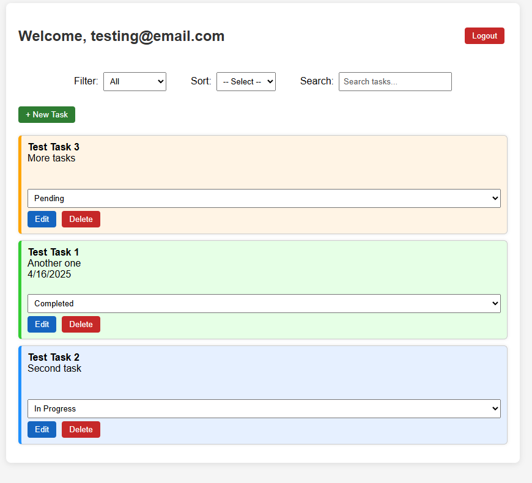

# Task Manager Web App

A full-stack task manager app with **FastAPI** and **PostgreSQL**, featuring **JWT**-based user authentication, **CRUD** operations, task filtering, sorting, and search. **Dockerized** and **Alembic**-enabled for production-ready deployment and migrations.

---
## Contents 

- [Features](#features)
- [Tech Stack](#tech-stack)
- [Usage](#usage)
- [How to Install](#how-to-install)
- [Development](#development)
- [Testing](#testing)
- [License](#license)

---
## Features

- User authentication (Sign Up, Log In)
- CRUD operations on tasks (Create, Read, Update, Delete)
- Task filtering, sorting and searching.
- Dockerized for easy setup and deployment.

---
## Tech Stack

- **Frontend**: HTML, CSS, JavaScript
- **Backend**: FastAPI (Python 3.11)
- **Database**: PostgreSQL
- **Authentication**: JWT
- **ORM**: SQLAlchemy
- **Database Migrations**: Alembic
- **Containerization**: Docker

---
## Usage

1. Sign Up and Log In:

- Create an account in the register page.


- Log in through the login page (home page).


2. Handle tasks from the dashboard:

- Tasks have the following attributes: Title, Description, Due Date, and Status.
- You can add new tasks, edit existing ones or delete them.
- Use the filter dropdown to view tasks by their status
- Sort tasks by date or status.
- Use the search box to find tasks based on their title or description.



---
## How to Install

1. Clone the repository:

```bash
git clone https://github.com/idalz/task-manager-web-app.git
```

2. Set up environment variables:

Create a `.env` file in the root directory (task-manager-web-app) and add the following variables:

```
DATABASE_URL=postgresql+psycopg2://<your-username>:<your-password>@db:5432/task_manager_db
SECRET_KEY=<your-secret-key>
POSTGRES_USER=<your-postgres-username>
POSTGRES_PASSWORD=<your-postgres-password>  
```

3. Docker Setup:

Run the following commands to start the application and database container:

```bash
docker-compose up --build
```

This will:

- Build and start both containers (app and postgreSQL).
- Persist data in a Docker volume so database content is saved.

4. Database Setup (with Alembic):

Inside the app container run the following to set up the schemas:

```bash
docker-compose exec app alembic upgrade head
```

This will create the necessary tables: `users` and `tasks`.

5. Run the application:

The app will be running at http://localhost:8000.

---
## Development

Running Locally Without Docker:

1. Install the dependencies:

```bash 
pip install -r requirements.txt
```

2. Set up the environment variables in `.env`:

You may need to change the `DATABASE_URL` to `localhost`: 

```
DATABASE_URL=postgresql+psycopg2://<your-username>:<your-password>@localhost:5432/task_manager_db
...
```

3. Create a PostgreSQL database named `task_manager_db`.

4. Run Alembic Migrations Locally:

```bash
alembic upgrade head
```

5. Run the FastAPI app:

```bash
uvicorn app.main:app --reload
```  

6. Access the app at http://localhost:8000.

---
## Testing

If you would like to run tests, ensure you installed pytest:

```bash
pip install pytest
```

Tests currently use SQLite for simplicity.

---
## License
This project is licensed under the [MIT License](LICENSE).

